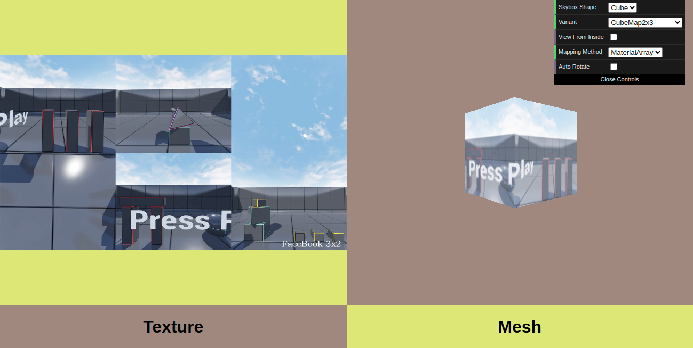

# Js Skybox Mapping



## Overview

js-skybox-mapping is a demo project showcasing how to wrap a flat texture image file onto a 3D skybox using Three.js. The project currently supports multiple cubemap layouts (3x2, 3x4 etc) and supports two mapping methods:

1. **UV Mapping:**  This method involves manually assigning UV coordinates to accurately map the texture onto the skybox faces.

2. **Material Array:** With this approach, each face of the skybox gets its own material. Use this method if you plan on adding video texture to the skybox

 

## Cubemap and Skybox

### Cubemap

A cubemap is a type of texture used to represent a 3D environment. It is a collection of six square images arranged like the faces of a cube. Each texture represents a view from a different direction: up, down, left, right, front, and back.These images are often used in computer graphics to create reflections, skyboxes, or environment mapping effects. Cubemaps can be generated in different layouts depending on how the faces of the cube are arranged. A couple of layouts are shown below

| 3x4 Layout | 2x3 Layout |
|------------|------------|
|  |  |


### Skybox

A skybox is a method used in computer graphics to create the illusion of a vast environment surrounding a scene. It typically involves wrapping a cube or a sphere with textures representing a distant background. By rendering the scene inside this cube, with the camera at the center, it appears as though the scene is surrounded by the textures of the skybox.

## Features

- Mapping any cubemap layout onto a cube skybox
- Supports video textures as well
- Multiple mapping methods - Manual UV Mapping and Assigning Material Array

## Planned Features

- Support for Spherical textures

## Getting Started

To run the project locally, follow these steps:

1. Clone this repository to your local machine.
2. Navigate to the project directory.
3. Run `npm install` then `npm run dev`. This will start a local `vite` server
4. Open `localhost:5173` in your browser

## Usage

To add a new cubemap layout, follow these steps:

1. Prepare your cubemap image in the appropriate format.
2. Add the image to the `images` directory.
3. Create a new `Variant` in the `VARIANTS` object in `cube.js` with a layout name, the path to the layout image and a list denoting how the faces are structured in the layout.
4. Save your edits and refresh the project in your browser. Your new variant will be available for selection in the GUI under "Variant" dropdown

## Example

Suppose you have a cubemap layout image with 3 rows and 2 columns similar to [demo_cubemap3x2.png](images/demo_cubemap3x2.png). Follow these steps to add it:

1. Place the image in the images folder.
2. In `cube.js`, add a new variant to the `VARIANTS` object. Use the following structure:

```javascript
CubeMap3x2: new Variant("DemoCubeMap3x2", cubemap3x2Txt, [
    [FACES.FRONT, FACES.BACK],  // First row
    [FACES.LEFT, FACES.UP],      // Second row
    [FACES.RIGHT, FACES.DOWN],   // Third row
])
```

In this variant:

* Each list inside the outer list represents a row of the cubemap layout.
* Each item within a row list corresponds to a cell in the layout, specifying which face of the cube it represents.

## Image Credits

The images used in this project are sourced from [Camera 360 V2 Unreal Engine plugin](https://www.unrealengine.com/marketplace/en-US/product/camera-360-v2).

## License

This project is licensed under the MIT License - see the [LICENSE](LICENSE.txt) file for details.

## Forking and Usage

While the future support of this project is uncertain, anyone is welcome to fork and use this framework to build their own codebase. Feel free to customize and extend it based on your requirements.
